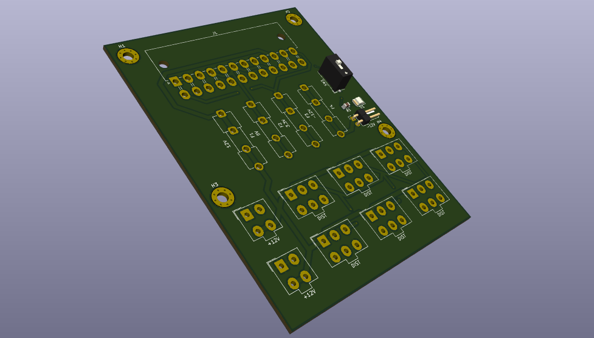
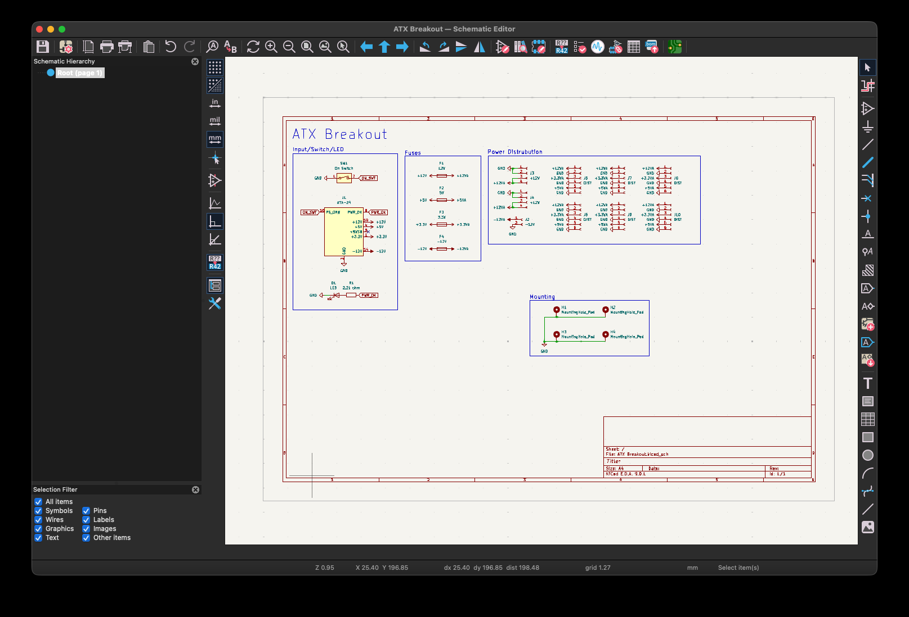
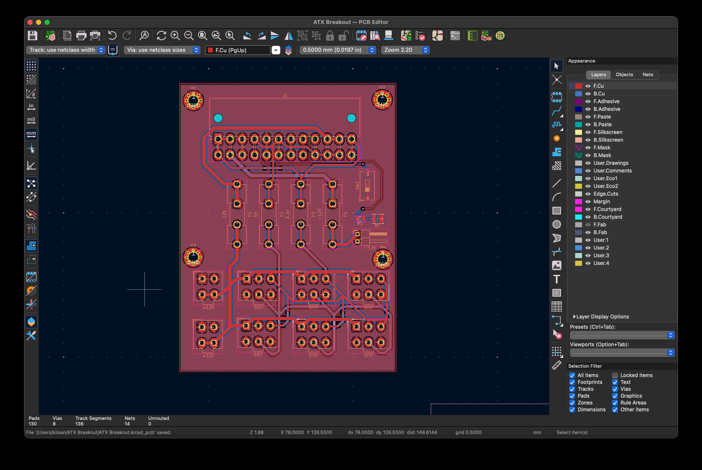

  <h1 align="center">ATX Breakout</h1>

  

  

  <a href="https://blueprint.hackclub.com/">
    </img>
  </a>
  

  <h1></h1>
  

    A simple ATX Breakout-Board to Power 12V 5V and 3V3 Devices from an standart PC Powersupply.
  

This work is licensed under the
[MIT License](https://mit-license.org).

## Table of Contents

- [About](#about)
- [Pictures](#pictures)
- [Bill of Materials](#bill-of-materials)

# About

I have a dream, a hole system of electronics and devices for the live event industry to learn to develop mixing consoles and other systems. so this is one of the base components for everything i will make in the future. I will use this board as a power distribution board to supply power to the internal electronic devices in the Kiloan Desk chassis for now.

# Pictures

# Bill of Materials

<strong>Show Bill Of Materials(BOM) ----></strong>

|Designator             |Footprint                                                                     |Quantity|Value    |LCSC Part #|
|-----------------------|------------------------------------------------------------------------------|--------|---------|-----------|
|D1                     |1210                                                                          |1       |LED      |C601676    |
|F1                     |Fuseholder_Clip-5x20mm_Eaton_1A5601-01_Inline_P20.80x6.76mm_D1.70mm_Horizontal|1       |12V      |C3206715   |
|F2                     |Fuseholder_Clip-5x20mm_Eaton_1A5601-01_Inline_P20.80x6.76mm_D1.70mm_Horizontal|1       |5V       |C3206715   |
|F3                     |Fuseholder_Clip-5x20mm_Eaton_1A5601-01_Inline_P20.80x6.76mm_D1.70mm_Horizontal|1       |3.3V     |C3206715   |
|F4                     |Fuseholder_Clip-5x20mm_Eaton_1A5601-01_Inline_P20.80x6.76mm_D1.70mm_Horizontal|1       |-12V     |C3206715   |
|J1                     |Molex_Mini-Fit_Jr_5569-24A2_2x12_P4.20mm_Horizontal                           |1       |ATX-24   |C492361    |
|J10, J5, J6, J7, J8, J9|Molex_Mini-Fit_Jr_5566-06A_2x03_P4.20mm_Vertical                              |6       |DIST     |C471417    |
|J2                     |PinHeader_1x02_P2.54mm_Horizontal                                             |1       |-12V     |C492401    |
|J3, J4                 |Molex_Mini-Fit_Jr_5566-04A_2x02_P4.20mm_Vertical                              |2       |+12V     |C293502    |
|R1                     |0805                                                                          |1       |2.2k ohm |C17520     |
|SW1                    |SW_DIP_SPSTx01_Slide_9.78x4.72mm_W8.61mm_P2.54mm                              |1       |On Switch|C3293151   |
|JLCPCB Quote: 6.54 Dollar|                                                                            |        |         |           |
|LCSC Quote: 26.14 Dollar |                                                                            |        |         |           |
|Quote: 32.68 Dollar      |                                                                            |        |         |           |

